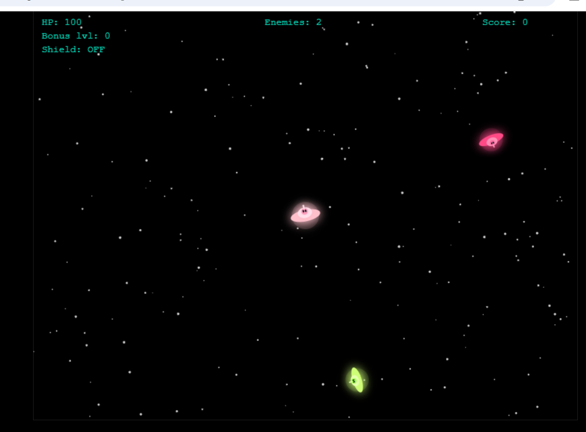

# Neon Arena Game

Neon Arena is a 2D arcade-style survival game built with JavaScript and HTML Canvas using an ECS (Entity Component System) architecture.

The project focuses on real-time gameplay systems, enemy AI behavior, collision detection, rendering pipelines, and dynamic difficulty scaling inspired by game-engine architecture.

## Features
- ECS-inspired game architecture
- Real-time rendering loop
- Enemy AI movement system
- Collision detection
- Dynamic difficulty scaling
- Projectile and combat systems
- Mouse aiming and player rotation
- Particle and neon visual effects
- Responsive gameplay mechanics

## Technologies
- JavaScript
- HTML5 Canvas
- Functional programming concepts
- ECS architecture
- Real-time systems

## Gameplay Systems
- Input handling system
- Movement system
- Enemy AI tracking
- Bullet and projectile logic
- Collision system
- Damage and health system
- Spawn manager
- Rendering pipeline

## What I Learned
- Real-time game loop architecture
- Entity Component System design principles
- Collision detection algorithms
- Performance optimization in browser rendering
- Enemy movement and targeting logic
- Interactive gameplay programming
- State management in games

## Purpose
This project was created to explore game development, interactive systems, and software architecture through a fully playable browser game.

It reflects my interests in game engineering, graphics, AI behavior systems, and real-time applications.
